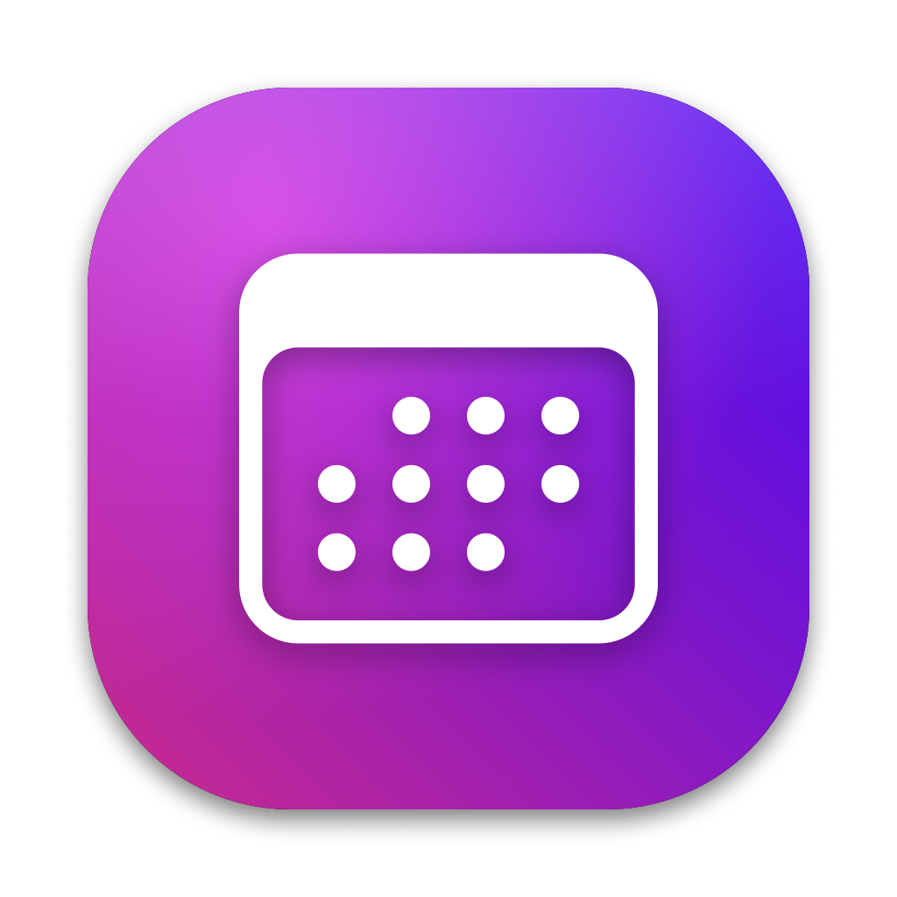

<p align="center">
  
</p>

<h1 align="center">Upcoming</h1>

<p align="center"><strong>A menu bar companion for Apple Calendar.</strong><br>
Your month and your agenda, one click (or one hotkey) away — styled to feel
like Calendar, fed by the calendars you already have.</p>

---

Upcoming lives in your menu bar and pops up a month grid with an agenda
list underneath. It reads everything Calendar.app already syncs — iCloud,
Microsoft 365 / Exchange, Google, subscriptions — through Apple's EventKit.
That means **no account setup, no OAuth, no third-party sync**: if it shows
in Calendar, it shows in Upcoming.

It's a companion, not a replacement. Creating and editing events stays in
Calendar (click any event to jump straight to it); Upcoming is for the
hundred times a day you just need to *see* what's coming.

## What you get

- **Month grid** with week numbers, per-calendar colour dots, and a red
  today marker — Calendar's visual language, including its exact pill
  colours (measured per pixel, light and dark mode).
- **Agenda list** that starts at today and scrolls endlessly in both
  directions. The grid follows along as you scroll, paging into other
  months.
- **Hover previews**: hover any event for an Apple-Calendar-style detail
  popover — attendees and their replies, notes, recurrence, and a map of
  the location with the local temperature. Hover a grid day to preview
  its agenda without leaving the grid.
- **Join calls fast**: video-call links (Teams, Zoom, Meet, …) get a join
  icon that swells into a "Join · N min" button when the call is about to
  start. A global shortcut (default ⌘⇧J) and the icon's right-click menu
  join the ongoing or next call from anywhere, an optional notification
  before each call carries a Join button, and the popover copies the
  meeting link for sharing. Teams links open in the Teams app.
- **Search** across years of events, past and future, with a TODAY divider
  keeping the results oriented.
- **Invitation status at a glance**: unanswered invitations get Calendar's
  grey hatching, "maybe" replies the tinted variant, declined meetings are
  filtered out entirely.
- **Keyboard navigation**: arrows step a day, ⌘-arrows a week, Escape
  closes. Global hotkey (default ⌘⇧C) from anywhere.
- **All-day pills** that wrap instead of truncate, with optional combining
  of busy days ("Team · 4"), recurrence markers, and birthdays as a
  gift-icon row.
- **Per-calendar toggles**, launch at login, light/dark with the system,
  auto-updates via Sparkle.

## What it deliberately doesn't do

- No event editor. Each day's + button starts a new event and hands you
  straight to Calendar to fill it in; editing existing events is one
  click away in Calendar too.
- No own calendar accounts. macOS Internet Accounts does the syncing;
  Upcoming never talks to a calendar provider and never sees your
  credentials.
- No analytics. Network use is limited to Apple's map/weather services
  for the hover popover and the GitHub update check.

## Install

Grab the notarized build from
[Releases](https://github.com/thimo/upcoming/releases), unzip, drop
`Upcoming.app` in Applications, and grant Calendar access on first launch.

Requires macOS 14 or later.

## Build from source

```sh
./build.sh
```

Builds, tests, signs, and installs to `/Applications/Upcoming.app` (not `~/Applications`: on macOS 27 the menu bar agent only manages status items of apps running from `/Applications`).
Requires the Xcode Command Line Tools (no Xcode needed).

## Status

Young but used daily by its author, and it keeps itself up to date via
Sparkle. The visual polish runs deep (Calendar's pill colours are matched
to the pixel); the feature set is intentionally small. See `docs/spec.md`
for decisions and `CLAUDE.md` for the roadmap.

## License

[MIT](LICENSE)
